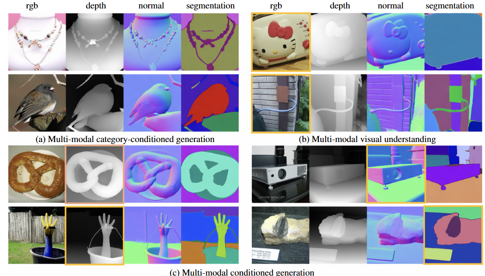

# MMGen: Unified Multi-modal Image Generation and Understanding in One Go
In this paper, we introduce MMGen, a unified framework that integrates multiple generative tasks into a single diffusion model, more importantly, in one diffusion process. 

This includes: (1) multi-modal category-conditioned generation, where multi-modal outputs are generated simultaneously through a single inference process, given category information; (2) multi-modal visual understanding, which accurately predicts depth, surface normals, and segmentation maps from RGB images; and (3) multi-modal conditioned generation, which produces corresponding RGB images based on specific modality conditions and other aligned modalities.




## [Project page](https://jiepengwang.github.io/MMGen/) |  [Paper](https://arxiv.org/abs/2503.20644)  |  [Data](https:***)

Code is coming soon.

If you have any questions about this project or want any discussions, feel free to drop me an [email](https://jiepengwang.github.io).


## Citation

Cite as below if you find this repository is helpful to your project:

```
@article{wang2025mmgen,
  title={MMGen: Unified Multi-modal Image Generation and Understanding in One Go},
  author={Wang, Jiepeng and Wang, Zhaoqing and Pan, Hao and Liu, Yuan and Yu, Dongdong and Wang, Changhu and Wang, Wenping},
  journal={arXiv preprint arXiv:2503.20644},
  year={2025}
}
```
