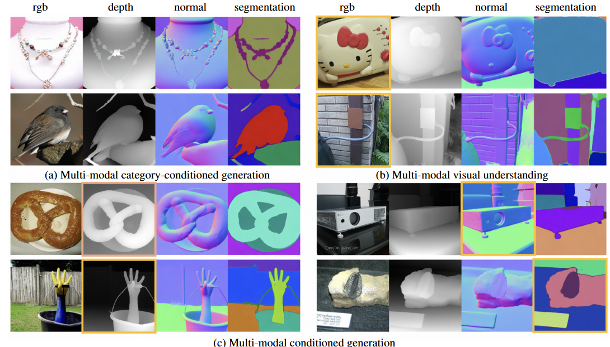

# MMGen: Unified Multi-modal Image Generation and Understanding in One Go

In this paper, we introduce MMGen, a unified framework that integrates
multiple generative tasks into a single diffusion model, more importantly, in
one diffusion process. This includes: (1) multi-modal category-conditioned
generation, where multi-modal outputs are generated simultaneously through a
single inference process, given category information; (2) multi-modal visual
understanding, which predicts depth, surface normals, and segmentation maps
from RGB images; and (3) multi-modal conditioned generation, which produces
corresponding RGB images based on specific modality conditions and other
aligned modalities.

This repository contains the official implementation, released checkpoints,
ImageNet training recipe, Hypersim fine-tuning recipe, modality preprocessing,
and inference code for these tasks. MMGen uses a shared VAE and a multi-modal
Diffusion Transformer with modality-decoupled timesteps and task embeddings.

## [Project Page](https://jiepengwang.github.io/MMGen/) | [Paper](https://arxiv.org/abs/2503.20644) | [Code](https://github.com/jiepengwang/MMGen/) | [Checkpoints](https://huggingface.co/jiepengwang/MMGen)



## Task layout

| Index | Modality | Latent channels |
|---|---|---:|
| 0 | RGB | 4 |
| 1 | Depth visualization | 4 |
| 2 | Surface normal | 4 |
| 3 | Segmentation mask | 4 |

The four VAE latents are concatenated into a 16-channel SiT input. Checkpoint
architecture flags must therefore include `--num-tasks 4 --is-mmcat-diff
--use-decouple-task --use-taskcond-emb`.

## Installation

Python 3.9 or newer, PyTorch 2.6 or newer, and a CUDA-capable GPU are required
for the released checkpoint workflow.

```bash
conda create -n mmgen python=3.9 -y
conda activate mmgen
pip install -r requirements.txt
```

The default VAE id is `stabilityai/sd-vae-ft-mse`. Pass a local directory
through `VAE_PATH` or `--vae-path` for offline use.

## Model and checkpoints

Large checkpoints are not committed to Git. Download them from the Hugging
Face repository linked below and place the files under `ckpt/`.

| File | Description | Step | Download | Size | SHA256 |
|---|---|---:|---|---:|---|
| `0600000.pt` | Base four-task checkpoint trained on ImageNet-derived modalities | 600,000 | [Hugging Face](https://huggingface.co/jiepengwang/MMGen) | 11,112,542,326 bytes | `7ea94acea622134dc2f94b704b7d657f34861d6ac4450cb341e9c1bfb280877e` |
| `0620000.pt` | Base fine-tuned on Hypersim for RGB-conditioned depth/normal/mask generation | 620,000 | [Hugging Face](https://huggingface.co/jiepengwang/MMGen) | 11,112,546,899 bytes | `ab4c9423ed55ad0b845815dcf59d68d5e12265b846682065c858fc67f39be0ba` |

Both artifacts contain `model`, `ema`, `opt`, `args`, and `steps`. The
recorded steps are 600,000 and 620,000. The released model is SiT-XL/2 at
256 x 256 with four 4-channel VAE latents, RGB-only DINOv2 ViT-B/14 features,
and a 0.1 class-label dropout probability using the 1001-entry ImageNet label
embedding.

Verify the published SHA256 before loading a checkpoint. The code uses
PyTorch's restricted weights-only loader and allowlists only the
`argparse.Namespace` metadata stored by the legacy 600k/620k format.


## Inference

Generate all four modalities from an ImageNet category:

```bash
CUDA_VISIBLE_DEVICES=0 python exp_sample.py \
  --ckpt ckpt/0600000.pt \
  --condition-task category --class-label 207 --num-samples 4
```

Run RGB visual understanding with the convenience wrapper:

```bash
INPUT=/path/to/image-or-directory \
CKPT=ckpt/0620000.pt \
bash scripts/inference/infer_rgb2x.sh
```

Outputs are written below `exps/infer_rgb2x/` as `task_0` through
`task_3`, plus a side-by-side `task_merge`. The wrapper uses one GPU and
keeps the architecture flags aligned with the released checkpoints. Depth,
normal, and mask inputs are also supported through `--condition-task`. See
[docs/infer_rgb2x.md](docs/infer_rgb2x.md) for all three inference modes.

## Data preparation

Training reads a JSONL index plus precomputed HDF5 files; it does not encode
raw images online.

```text
ImageNet RGB images
  -> data/preprocess_{depth,normal,mask}.py
  -> aligned RGB/depth/normal/mask image trees
  -> data/prepare_meta_data.py
  -> train.jsonl
  -> data/preprocess_vae.py (once per modality)
  -> data/preprocess_dino.py (RGB only)
  -> train.py
```

The supported metadata schema, directory layout, Hypersim commands, and HDF5
contract are documented in [docs/data_preparation.md](docs/data_preparation.md).
No script depends on a hostname or an internal mount. Paths can be passed on
the CLI or set through the `REPA_*` variables defined in [data/path.py](data/path.py).

## Training and fine-tuning

The released 600k ImageNet recipe is:

```bash
METADATA=/path/to/train.jsonl \
VAE_RGB_H5=/path/to/vae/rgb.h5 \
VAE_DEPTH_H5=/path/to/vae/depth.h5 \
VAE_NORMAL_H5=/path/to/vae/normal.h5 \
VAE_MASK_H5=/path/to/vae/mask.h5 \
DINO_RGB_H5=/path/to/dino/rgb.h5 \
bash scripts/train_imagenet.sh
```

The underlying entry point remains `train.py`. A direct four-task launch is:

```bash
accelerate launch train.py \
  --exp-name mmgen \
  --model SiT-XL/2 \
  --metadata-path /path/to/train.jsonl \
  --vae-rgb-h5 /path/to/vae/rgb.h5 \
  --vae-depth-h5 /path/to/vae/depth.h5 \
  --vae-normal-h5 /path/to/vae/normal.h5 \
  --vae-mask-h5 /path/to/vae/mask.h5 \
  --dino-rgb-h5 /path/to/dino/rgb.h5 \
  --is-mmcat-diff --num-tasks 4 \
  --use-decouple-task --use-taskcond-emb
```

Verified Hypersim recipes are provided as shell wrappers:

- `scripts/finetune_hypersim.sh`: joint four-task fine-tuning.
- `scripts/finetune_hypersim_rgb2x.sh`: fixed RGB condition, supervising
  depth/normal/mask; this produces the 620k release checkpoint.

Both wrappers accept `CKPT`, `METADATA`, the HDF5 path variables, `GPU`,
`NPROC`, `BATCH`, and `MAX_STEPS`. Note that `MAX_STEPS` is the
absolute global step, not the number of additional steps. See
[docs/training.md](docs/training.md) for the full recipe and resume behavior.

## Documentation

The public documentation is intentionally limited to the reproducible core:

- [docs/data_preparation.md](docs/data_preparation.md): JSONL schema,
  pseudo-label generation, and HDF5 contracts.
- [docs/training.md](docs/training.md): ImageNet training and Hypersim
  fine-tuning recipes.
- [docs/infer_rgb2x.md](docs/infer_rgb2x.md): category, RGB, depth, normal,
  and mask conditioned inference.

## Repository layout

| Path | Purpose |
|---|---|
| `models/sit.py` | SiT backbone and multi-modal extensions |
| `loss.py` | Stochastic-interpolant and REPA alignment losses |
| `samplers.py` | ODE and SDE samplers |
| `train.py` | Distributed training and checkpointing |
| `exp_sample.py`, `scripts/inference/infer_rgb2x.sh` | Conditional multi-modal inference |
| `data/` | Pseudo-labels, metadata, VAE/DINO HDF5 preprocessing, dataset |
| `scripts/` | Training, fine-tuning, inference, and validation launchers |
| `utils/` | Restricted checkpoint loading and shared latent helpers |

## Validation

Run the offline release checks after installing the dependencies:

```bash
bash scripts/validate_release.sh
```

To include strict loading and one conditional sampling step with a release
checkpoint:

```bash
REPA_RELEASE_CKPT=ckpt/0600000.pt bash scripts/validate_release.sh
```

Validation exercised `scripts/inference/infer_rgb2x.sh` end to
end with both 600k and 620k checkpoints, category generation,
depth-conditioned generation, a real Depth Anything V2-Large pseudo-label
pass, and one four-task optimizer step from VAE/DINO HDF5 inputs. These checks
establish pipeline compatibility, not output quality or benchmark performance.


## Citation

Cite as below if you find this repository is helpful to your project:

```
@article{wang2025mmgen,
  title={MMGen: Unified Multi-modal Image Generation and Understanding in One Go},
  author={Wang, Jiepeng and Wang, Zhaoqing and Pan, Hao and Liu, Yuan and Yu, Dongdong and Wang, Changhu and Wang, Wenping},
  journal={arXiv preprint arXiv:2503.20644},
  year={2025}
}
```

## Acknowledgements

This project builds on the MIT-licensed [REPA implementation](https://github.com/sihyun-yu/REPA); we thank its authors for making it available.

We also thank the authors and providers of [DINOv2](https://github.com/facebookresearch/dinov2),
[Stable Diffusion VAE](https://huggingface.co/stabilityai/sd-vae-ft-mse),
[Depth Anything V2](https://github.com/DepthAnything/Depth-Anything-V2),
[StableNormal](https://github.com/Stable-X/StableNormal),
[Semantic-SAM](https://github.com/UX-Decoder/Semantic-SAM),
[ImageNet](https://www.image-net.org/), and
[Hypersim](https://github.com/apple/ml-hypersim).
